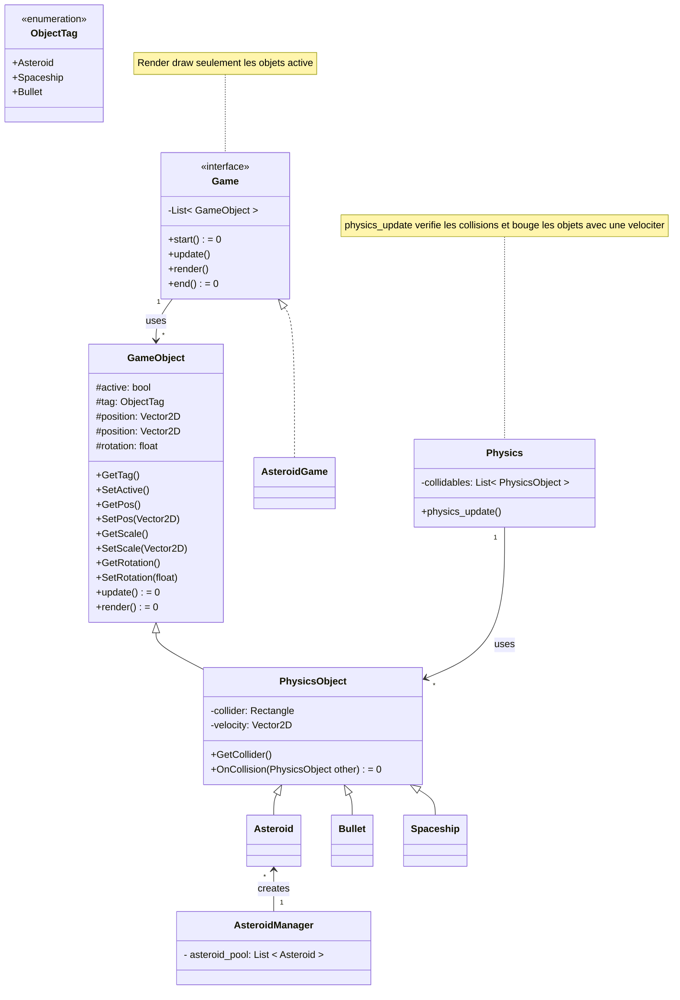

# asteroid

```mermaid
classDiagram
    class Game {
        <<interface>>
        -List< GameObject >
        +start() = 0
        +update()
        +render()
        +end() = 0
    }

    class ObjectTag {
        <<enumeration>>
        +Asteroid
        +Spaceship
        +Bullet
    }

  class GameObject {
    #active: bool
    #tag: ObjectTag
    #position: Vector2D

    #position: Vector2D

    #rotation: float

    +GetTag()
    +SetActive()
    +GetPos()

    +SetPos(Vector2D)

    +GetScale()

    +SetScale(Vector2D)

    +GetRotation()

    +SetRotation(float)

    +update() = 0

    +render() = 0

  }

    class PhysicsObject {
        -collider: Rectangle
        -velocity: Vector2D
        +GetCollider()
        +OnCollision(PhysicsObject other) = 0
    }

  class Physics {

    -collidables: List< PhysicsObject >

    +physics_update()

  }

  

  class Asteroid {

  }
    class AsteroidManager {
        - asteroid_pool: List < Asteroid >

    }
  

  GameObject <|-- PhysicsObject

  Game "1" --> "*" GameObject : uses

Asteroid "*" <-- "1"AsteroidManager : creates

  Physics "1" --> "*"PhysicsObject : uses

  Game <|.. AsteroidGame

  PhysicsObject <|-- Asteroid

  PhysicsObject <|-- Bullet

  PhysicsObject <|-- Spaceship

 %% Comment explaining the update method

 note for Physics "physics_update verifie les collisions et bouge les objets avec une velociter"
 note for Game "Render draw seulement les objets active"
 
```
