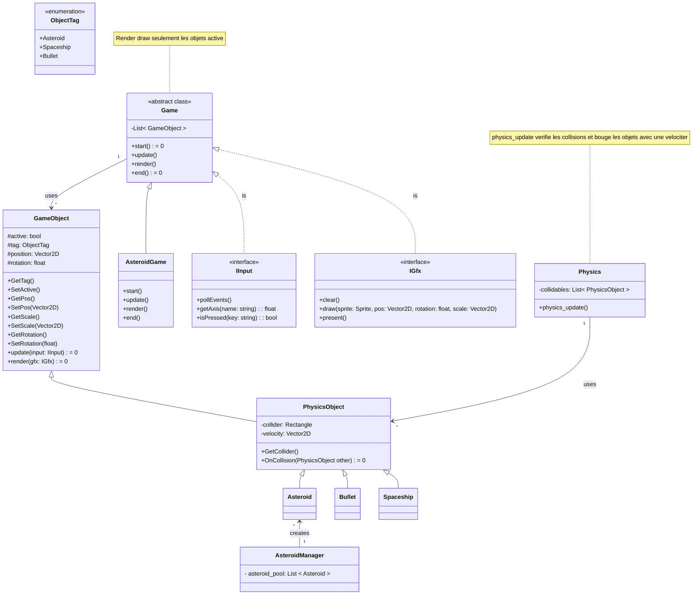

# asteroid

```mermaid
classDiagram
    class Game {
        <<abstract class>>
        -List< GameObject >
        +start() = 0
        +update()
        +render()
        +end() = 0
    }

    class ObjectTag {
        <<enumeration>>
        +Asteroid
        +Spaceship
        +Bullet
    }

    class IInput {
        <<interface>>
        +pollEvents()
        +getAxis(name: string): float
        +isPressed(key: string): bool
    }

    class IGfx {
        <<interface>>
        +clear()
        +draw(sprite: Sprite, pos: Vector2D, rotation: float, scale: Vector2D)
        +present()
    }

  class GameObject {
    #active: bool
    #tag: ObjectTag
    #position: Vector2D
    #rotation: float

    +GetTag()
    +SetActive()
    +GetPos()
    +SetPos(Vector2D)
    +GetScale()
    +SetScale(Vector2D)
    +GetRotation()
    +SetRotation(float)

    +update(input: IInput) = 0
    +render(gfx: IGfx) = 0
  }

    class PhysicsObject {
        -collider: Rectangle
        -velocity: Vector2D
        +GetCollider()
        +OnCollision(PhysicsObject other) = 0
    }

  class Physics {
    -collidables: List< PhysicsObject >
    +physics_update()
  }

  class Asteroid {

  }
    class AsteroidManager {
        - asteroid_pool: List < Asteroid >
    }

  class AsteroidGame {
    +start()
    +update()
    +render()
    +end()
  }

  GameObject <|-- PhysicsObject

  Game "1" --> "*" GameObject : uses

  Asteroid "*" <-- "1" AsteroidManager : creates

  Physics "1" --> "*" PhysicsObject : uses


  PhysicsObject <|-- Asteroid

  PhysicsObject <|-- Bullet

  PhysicsObject <|-- Spaceship


  Game <|-- AsteroidGame

  Game <|.. IInput : is
  Game <|.. IGfx : is

  %% Comment explaining the update method

  note for Physics "physics_update verifie les collisions et bouge les objets avec une velociter"
  note for Game "Render draw seulement les objets active"
```
